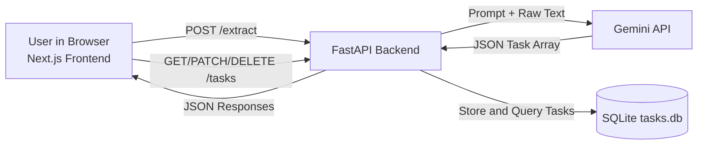

# Ops Assistant

AI Internal Ops Assistant that turns messy text (meeting notes, emails, raw task dumps) into structured action items and visualizes them on a Kanban board.

> Fast local MVP for internal operations teams: paste notes, extract structured tasks with AI, manage execution in a Kanban board.


This project is fully local-first for development:

- Backend: FastAPI + SQLite
- AI: Gemini API via `google-generativeai`
- Frontend: Next.js 14 (App Router) + TypeScript + Tailwind CSS
- Docker support included (optional)

## Features

- Extracts tasks from unstructured text using Gemini
- Enforces normalized task shape: task, owner, deadline, priority, status
- Persists tasks in SQLite
- Kanban board with 3 columns: To Do, In Progress, Done
- Inline status updates and task deletion from the board
- Retry-once logic if Gemini returns invalid JSON
- Dynamic model fallback if `gemini-1.5-flash` is not available for your API key

## Tech Stack

- Python 3.11+
- FastAPI
- SQLite (`sqlite3` built-in)
- Google Gemini API (`google-generativeai`)
- Next.js 14
- TypeScript
- Tailwind CSS

## Project Structure

```text
ops-assistant/
├── backend/
│   ├── main.py
│   ├── models.py
│   ├── database.py
│   ├── requirements.txt
│   ├── .env
│   └── .env.example
├── frontend/
│   ├── app/
│   ├── components/
│   ├── lib/
│   ├── types/
│   ├── package.json
│   └── .env.local.example
└── README.md
```

## Architecture



Runtime flow:

1. User pastes unstructured text on the home page.
2. Frontend sends it to `POST /extract`.
3. Backend prompts Gemini and expects JSON task output.
4. Backend normalizes and stores tasks in SQLite with `status="todo"`.
5. Board page reads tasks and allows status updates/deletions.

## Quick Start

### 1. Backend setup (Terminal 1)

```bash
cd backend
python3.11 -m venv .venv311
source .venv311/bin/activate
pip install -r requirements.txt
cp .env.example .env
```

Edit `.env` and set your key:

```env
GEMINI_API_KEY=YOUR_GEMINI_API_KEY_HERE
```

Run backend:

```bash
uvicorn main:app --reload --host 127.0.0.1 --port 8000
```

Backend API base URL: `http://127.0.0.1:8000`

### 2. Frontend setup (Terminal 2)

```bash
cd frontend
cp .env.local.example .env.local
npm install
npm run dev
```

Frontend URL: `http://127.0.0.1:3000`

### 3. Run with Docker Compose (Backend + Frontend together)

If you prefer containers, this project includes:

- `backend/Dockerfile`
- `frontend/Dockerfile`
- `docker-compose.yml`

Steps:

```bash
cp backend/.env.example backend/.env
# add your GEMINI_API_KEY in backend/.env

docker compose up --build
```

Access URLs:

- Frontend: `http://localhost:3000`
- Backend: `http://localhost:8000`

Stop containers:

```bash
docker compose down
```

Rebuild after dependency changes:

```bash
docker compose up --build
```

## End-to-End Test

1. Open `http://127.0.0.1:3000`
2. Paste sample unstructured notes
3. Click **Extract Tasks**
4. Confirm redirect to `/board`
5. Move a task between columns using the status dropdown
6. Delete a task using the delete button

## API Reference

### POST `/extract`

Extracts tasks from unstructured text, normalizes fields, stores each task with `status="todo"`, and returns created tasks.

Request body:

```json
{
  "text": "raw unstructured text"
}
```

Response (example):

```json
[
  {
    "id": 1,
    "task": "Prepare budget summary",
    "owner": "Mark",
    "deadline": "Friday",
    "priority": "medium",
    "status": "todo",
    "created_at": "2026-03-31T10:00:00.000000"
  }
]
```

### GET `/tasks`

Returns all tasks ordered by newest first.

### PATCH `/tasks/{id}`

Updates task status.

Request body:

```json
{
  "status": "todo"
}
```

Allowed `status` values:

- `todo`
- `in_progress`
- `done`

### DELETE `/tasks/{id}`

Deletes a task by ID.

## cURL Examples

Extract:

```bash
curl -X POST http://127.0.0.1:8000/extract \
  -H "Content-Type: application/json" \
  -d '{"text":"Sarah drafts Q2 plan by Friday. Rahul cleans backlog this week."}'
```

List:

```bash
curl http://127.0.0.1:8000/tasks
```

Update status:

```bash
curl -X PATCH http://127.0.0.1:8000/tasks/1 \
  -H "Content-Type: application/json" \
  -d '{"status":"in_progress"}'
```

Delete:

```bash
curl -X DELETE http://127.0.0.1:8000/tasks/1
```

## Implementation Notes

- SQLite database file is created at `backend/tasks.db` automatically.
- CORS is enabled for `http://localhost:3000` and `http://127.0.0.1:3000`.
- Primary configured Gemini model is `gemini-1.5-flash`.
- If that model is unavailable for the current API key, backend auto-falls back to an available Flash model.
- If Gemini output is malformed JSON, backend retries once with a stricter prompt.

## Troubleshooting

### `bash: .venv311/bin/python: No such file or directory`

You are likely running from the wrong folder.

Use either:

```bash
cd /home/faizal/Projects/ops-assistant/backend
.venv311/bin/python -m uvicorn main:app --host 127.0.0.1 --port 8000
```

Or absolute path:

```bash
/home/faizal/Projects/ops-assistant/backend/.venv311/bin/python -m uvicorn main:app --app-dir /home/faizal/Projects/ops-assistant/backend --host 127.0.0.1 --port 8000
```

### Frontend does not start

- Ensure Node 20+ is active
- Ensure frontend env file exists (`frontend/.env.local`). If missing, create it from `frontend/.env.local.example`.
- In `frontend`, use `cp .env.local.example .env.local` (not `cp .env.example .env`).
- Reinstall deps and rebuild:

```bash
cd frontend
rm -rf node_modules .next
npm install
npm run build
npm run dev
```

### Docker build fails at backend pip install

If you see `ReadTimeoutError` while building backend image, it is a network timeout during Python package download.

Retry with a fresh build:

```bash
docker compose build --no-cache backend
docker compose up --build
```

## Security and GitHub Push Checklist

- Do not commit real API keys
- Keep `backend/.env` local only
- Commit `backend/.env.example` for template values
- Verify `.gitignore` includes env files and local build artifacts

## v1.0.0 Release Checklist

- [ ] Backend runs locally with `uvicorn` on port `8000`
- [ ] Frontend runs locally with `npm run dev` on port `3000`
- [ ] `POST /extract` succeeds with your Gemini key
- [ ] `GET /tasks`, `PATCH /tasks/{id}`, and `DELETE /tasks/{id}` verified
- [ ] `backend/.env` is not tracked by git and contains no committed secrets
- [ ] `backend/.env.example` and `frontend/.env.local.example` are up to date
- [ ] README setup steps tested from a clean shell
- [ ] Optional: screenshot GIF/images captured for GitHub project page
- [ ] Create first tag: `v1.0.0`

Suggested release commands:

```bash
git add .
git commit -m "Release: Ops Assistant v1.0.0"
git tag -a v1.0.0 -m "Ops Assistant MVP"
git push origin main --tags
```

## License

For internship/portfolio use. Add your preferred open-source license before public distribution.
