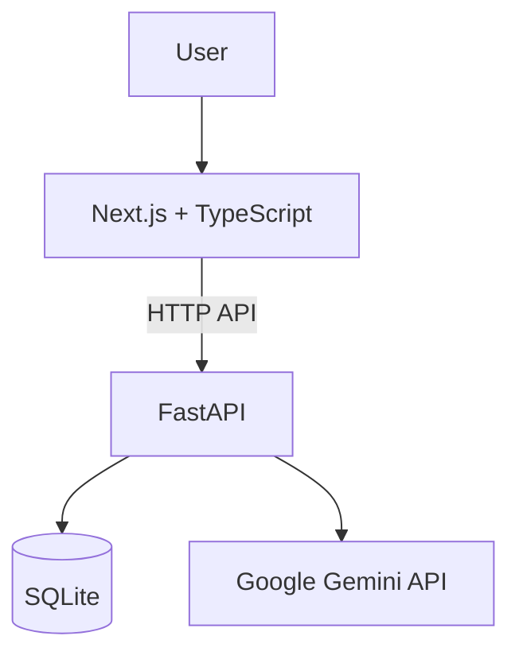

# Ops Assistant

Ops Assistant turns unstructured operational text—meeting notes, emails, and task dumps—into structured, actionable tasks. Tasks are reviewed and managed on a Kanban board.

## Features

- Gemini task extraction with schema-constrained JSON output
- Pydantic validation of every extracted task before database writes
- SQLite persistence
- Kanban board with status updates and task deletion
- Clear API and UI handling for validation, database, and Gemini failures
- One retry for malformed model output and Flash model fallback after upstream API errors
- Docker Compose support for local runs

## Architecture


```mermaid
flowchart TD
  User --> Next[Next.js + TypeScript]
  Next -->|HTTP API| API[FastAPI]
  API --> DB[(SQLite)]
  API --> Gemini[Google Gemini API]
```

The Gemini key is read by FastAPI from the backend environment. The browser only calls FastAPI.

## Tech stack

Python 3.11+, FastAPI, Pydantic, Google GenAI Python SDK (`google-genai`, Gemini 3.8 Flash with 3.7 Flash and 3.5 Flash-Lite fallbacks), SQLite, Next.js 14, TypeScript, Tailwind CSS, Docker, and pytest.

## Local setup

Requirements: Python 3.11+, Node.js 20+, npm, and a Gemini API key for extraction.

Backend (from the repository root):

```bash
cd backend
python3.11 -m venv .venv
source .venv/bin/activate
pip install -r requirements.txt
cp .env.example .env
# Set GEMINI_API_KEY in backend/.env
uvicorn main:app --reload --host 127.0.0.1 --port 8000
```

Frontend, in another terminal from the repository root:

```bash
cd frontend
cp .env.local.example .env.local
npm ci
npm run dev
```

Open http://localhost:3000. The backend API is at http://localhost:8000 and its health check is http://localhost:8000/health.

## Docker Compose

```bash
cp backend/.env.example backend/.env
# Set GEMINI_API_KEY in backend/.env
docker compose up --build
```

Open http://localhost:3000. API and health URLs are http://localhost:8000 and http://localhost:8000/health. SQLite is stored inside the backend container for this local MVP. Stop with `docker compose down`.

## Tests and checks

Run backend tests offline (Gemini is mocked):

```bash
cd backend
python -m pip install -r requirements.txt
python -m pytest -q
```

Frontend type check and production build:

```bash
cd frontend
npx tsc --noEmit
npm run build
```

## API

| Method | Path | Behavior |
| --- | --- | --- |
| GET | `/health` | Returns API liveness status |
| POST | `/extract` | Validates text, extracts tasks, stores and returns them |
| GET | `/tasks` | Lists tasks, newest first |
| PATCH | `/tasks/{id}` | Updates a task status (`todo`, `in_progress`, `done`) |
| DELETE | `/tasks/{id}` | Deletes a task |

`POST /extract` accepts `{"text":"..."}`. Empty or whitespace-only text and invalid update statuses receive HTTP 422. A missing task receives 404. Gemini failures are returned as 502, or 504 on timeout. Unexpected persistence failures receive 500 without exposing stack traces.

## Design decisions

- **Validate model output:** schema-constrained generation improves shape consistency, and Pydantic validates the complete response before any task is inserted. This protects SQLite from malformed or incomplete model output.
- **Use SQLite:** a local file is simple to run and sufficient for a single-user portfolio MVP; it avoids an extra database service.
- **Keep Gemini on the backend:** the API key stays out of browser code and frontend configuration.
- **Prefer structured output:** JSON schema gives the model a specific task shape and priority enum instead of relying on arbitrary prose parsing.
- **Retry and fallback:** malformed output gets one stricter retry. Transient model/API errors try alternate Flash model names before returning an upstream error.

## Limitations

This is a single-user application with no authentication or user accounts. SQLite is not intended for large concurrent deployments. Model extraction can still make semantic mistakes, so users should review tasks before acting on them. The local Docker setup does not configure persistent database volumes.

## Project layout

```text
backend/
  main.py
  models.py
  database.py
  routes/tasks.py
  services/gemini.py
  services/task_service.py
  tests/
frontend/
  app/
  components/
  lib/api.ts
  types/task.ts
docker-compose.yml
```
